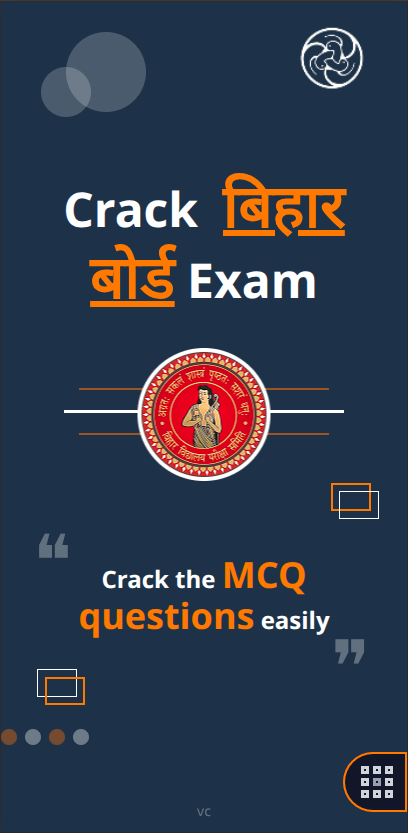
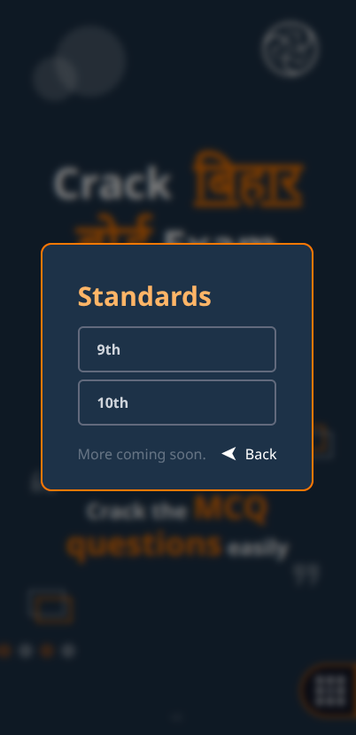
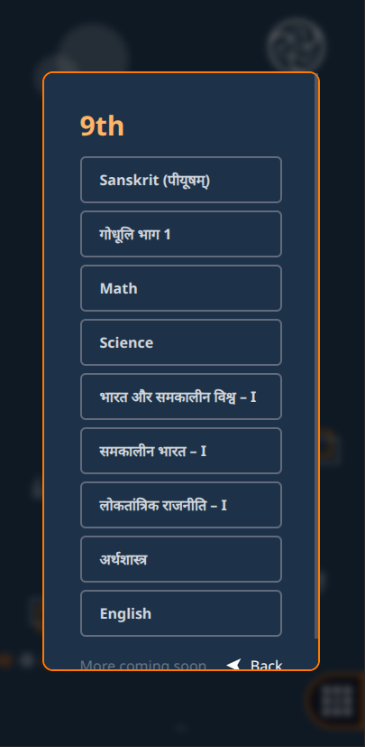
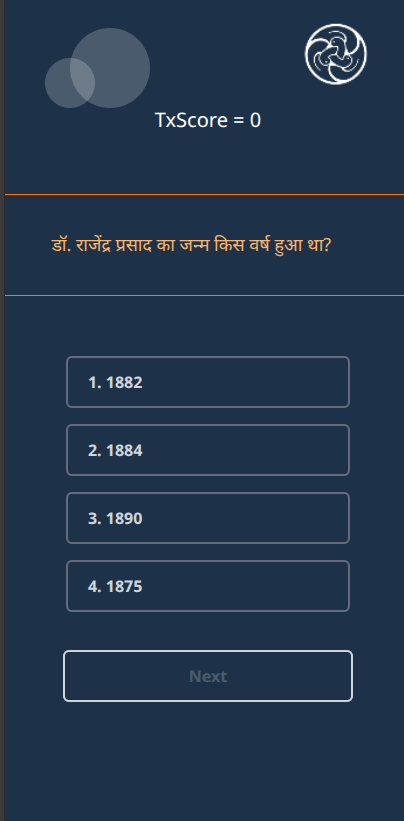

# VCMCQ – MCQ Practice Web App 🎯

Live Demo: https://vcmcq.netlify.app/

---

## 🚀 Overview

**VCMCQ** is a simple and interactive Multiple Choice Questions (MCQ) web application built with the **MERN stack** (MongoDB, Express, React, Node.js).  
It is designed to help users practice lessons by answering questions — if you answer incorrectly, the app will ask you **three new questions** until you get it right. This makes learning more effective and engaging.

---

## 🧠 Features

- 📚 Practice questions from different lessons.
- 🔁 Repeats questions if the answer is wrong (up to 3 new ones).
- 🚀 Built with a modern full-stack JavaScript stack.
- 🌐 Deployed live using Netlify.

---
## 📸 Screenshots

### 🏠 Home Page


### 📚 Standard Selection


### 📖 Subject Selection


### ❓ Question Page

---

## 🛠 Technologies Used

- **Frontend:** React, JavaScript  
- **Backend:** Node.js & Express.js  
- **Database:** MongoDB  
- **Deployment:** Netlify for frontend, Render for backend

---

## 🏁 How It Works

1. User selects a lesson or topic.
2. The app shows a multiple-choice question.
3. If the answer is correct ➡️ move to the next question.
4. If the answer is wrong ➡️ the app asks **three more new questions** to reinforce learning.

---

## 📦 Project Structure

```text
vcmcq/
├── backend/             # Server (Node + Express)
│   ├── controllers/
│   ├── models/
│   ├── routes/
│   └── server.js
├── frontend/            # React application
│   ├── public/
│   ├── src/
│   └── package.json
├── .gitignore
├── README.md
└── package.json

